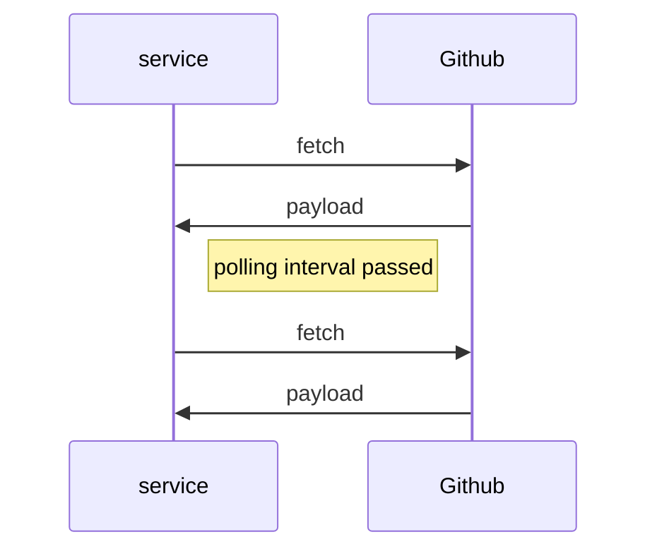
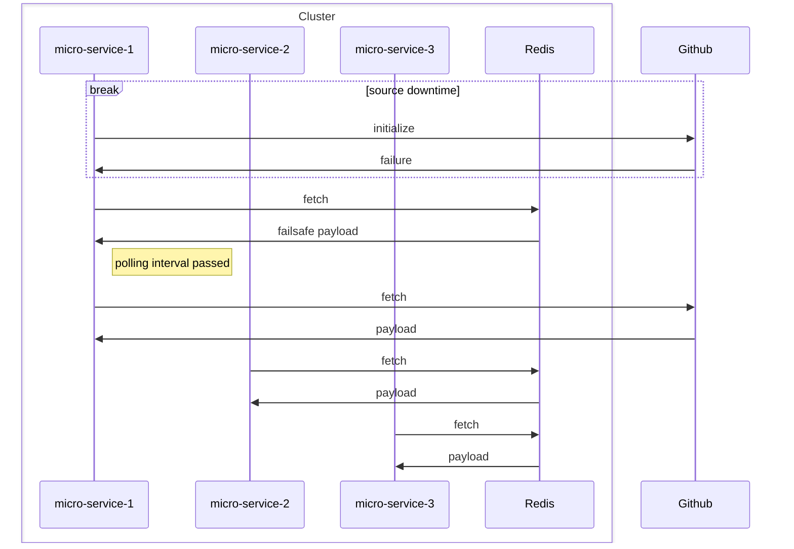

# Http Connector

## Introduction
Http Connector is a tool for [flagd](https://github.com/open-feature/flagd) in-process resolver.

This mode performs flag evaluations locally (in-process).  
Flag configurations for evaluation are obtained via Http.

## Http Connector functionality

HttpConnector is responsible for polling data from a specified URL at regular intervals.  
It is leveraging Http cache mechanism with 'ETag' header, then when receiving 304 Not Modified response,
reducing traffic, reducing rate limits effects and changes updates. Can be enabled via useHttpCache option.

## Use cases and benefits
* flagd installation is not required, the Http Connector works independently.  
  Minimizing infrastructure and DevOps overhead - no extra containers required.
* Low latency by fetching data directly in-process.
* Decreased external network traffic from the HTTP source, even without a standalone flagd container or proxy, 
  when using polling cache.
* Can serve as an additional provider for fallback or internal backup scenarios using a multi-provider setup.

### What happens if the Http source is down during application startup?

Http Connector supports optional resilient fail-safe initialization using a cache.
If the initial fetch fails due to source unavailability, it can load the initial payload from the cache instead of
falling back to default values.
This ensures smoother startup behavior until the source becomes available again. To be effective, the TTL of the
fallback cache should be longer than the expected duration of the source downtime during initialization.

### Polling cache
The polling cache is used to store the payload fetched from the URL.  
Used when usePollingCache is configured as true.
A key advantage of this cache is that it enables a single microservice within a cluster to handle the polling of a 
URL, effectively acting as a flagd/proxy while all other services leverage the shared cache. 
This approach optimizes resource usage by preventing redundant polling across services.

### Sample flows demonstrating the architecture

#### Basic Simple Configuration

This example demonstrates a simple flow using:
- GitHub as the source for flag payload.



#### A More Scalable Configuration Utilizing Fail-Safe and Polling Caching Mechanisms

This configuration aim to reduce network requests to the source URL, to improve performance and to improve the
application's resilience to source downtime.

This example demonstrates a micro-services architectural flow using:
- GitHub as the source for flag payload.
- Redis serving as both the fail-safe initialization cache and the polling cache.

Example initialization flow during GitHub downtime,
demonstrates how the application continues to access flag values from the cache even when GitHub is unavailable.
In this setup, multiple microservices share the same cache, with only one service responsible for polling the source
URL.



## Usage

### Installation
<!-- x-release-please-start-version -->
```xml
<dependency>
  <groupId>dev.openfeature.contrib.tools</groupId>
  <artifactId>flagd-http-connector</artifactId>
  <version>0.0.1</version>
</dependency>
```
<!-- x-release-please-end-version -->

### Usage example

```go
opts := &HttpConnectorOptions{
    PollIntervalSeconds:   10,
    ConnectTimeoutSeconds: 5,
    RequestTimeoutSeconds: 15,
    URL:                   "http://example.com",
}

connector, err := NewHttpConnector(*opts)

provider := flagd.NewProvider(
    flagd.WithInProcessResolver(),
    flagd.WithCustomSyncProvider(connector),
)
```

#### HttpConnector using fail-safe cache and polling cache

```go
opts := HttpConnectorOptions{
    URL:                   customUrl,
    PollIntervalSeconds:   5,
    ConnectTimeoutSeconds: 5,
    RequestTimeoutSeconds: 15,
    log:                   customLogger,
    PayloadCache:          customCache,
    UsePollingCache:       true,
    UseFailsafeCache:      true,
    PayloadCacheOptions: &PayloadCacheOptions{
        UpdateIntervalSeconds: 5,
    },
}

connector, err := NewHttpConnector(opts)
```

### Configuration
The Http Connector can be configured using the following properties in the `HttpConnectorOptions` class.:

| Property Name                             | Type                | Description                                                                                                                                                                                                                                                                                                                                                                         |
|-------------------------------------------|---------------------|-------------------------------------------------------------------------------------------------------------------------------------------------------------------------------------------------------------------------------------------------------------------------------------------------------------------------------------------------------------------------------------|
| url                                       | String              | The URL to poll for updates. This is a required field.                                                                                                                                                                                                                                                                                                                              |
| pollIntervalSeconds                       | Integer             | The interval in seconds at which the connector will poll the URL for updates. Default is 60 seconds.                                                                                                                                                                                                                                                                                |
| connectTimeoutSeconds                     | Integer             | The timeout in seconds for establishing a connection to the URL. Default is 10 seconds.                                                                                                                                                                                                                                                                                             |
| requestTimeoutSeconds                     | Integer             | The timeout in seconds for the request to complete. Default is 10 seconds.                                                                                                                                                                                                                                                                                                          |
                                                                                                                                                                                                                                                                                                   |
| headers                                   | Map<String, String> | A map of headers to be included in the request. Default is an empty map.                                                                                                                                                                                                                                                                                                            |
| httpClientExecutor                        | ExecutorService     | The executor service used for making HTTP requests. Default is a fixed thread pool with 1 thread.                                                                                                                                                                                                                                                                                   |
| proxyHost                                 | String              | The host of the proxy server to use for requests. Default is null.                                                                                                                                                                                                                                                                                                                  |
| proxyPort                                 | Integer             | The port of the proxy server to use for requests. Default is null.                                                                                                                                                                                                                                                                                                                  |
| payloadCacheOptions                       | PayloadCacheOptions | Options for configuring the payload cache. Default is null.                                                                                                                                                                                                                                                                                                                         |
| payloadCache                              | PayloadCache        | The payload cache to use for caching responses. Default is null.                                                                                                                                                                                                                                                                                                                    |
| useHttpCache                              | Boolean             | Whether to use HTTP caching for the requests. Default is false.                                                                                                                                                                                                                                                                                                                     |
| useFailsafeCache                          | Boolean             | Whether to use a failsafe cache for initialization. Default is false.                                                                                                                                                                                                                                                                                                               |
| usePollingCache                           | Boolean             | Whether to use a polling cache for initialization. Default is false.                                                                                                                                                                                                                                                                                                                |
| PayloadCacheOptions.updateIntervalSeconds | Integer             | The interval, in seconds, at which the cache is updated. By default, this is set to 30 minutes. The goal is to avoid overloading fallback cache writes, since the cache serves only as a fallback mechanism. Typically, this value can be tuned to be shorter than the cache's TTL, balancing the need to minimize unnecessary updates while still handling edge cases effectively. |
