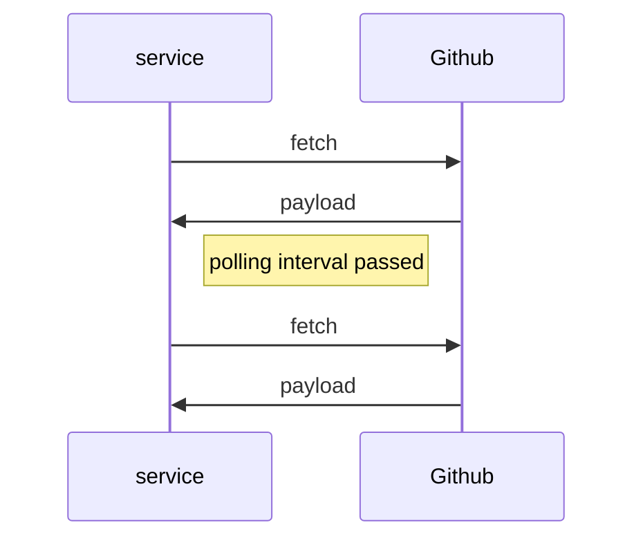
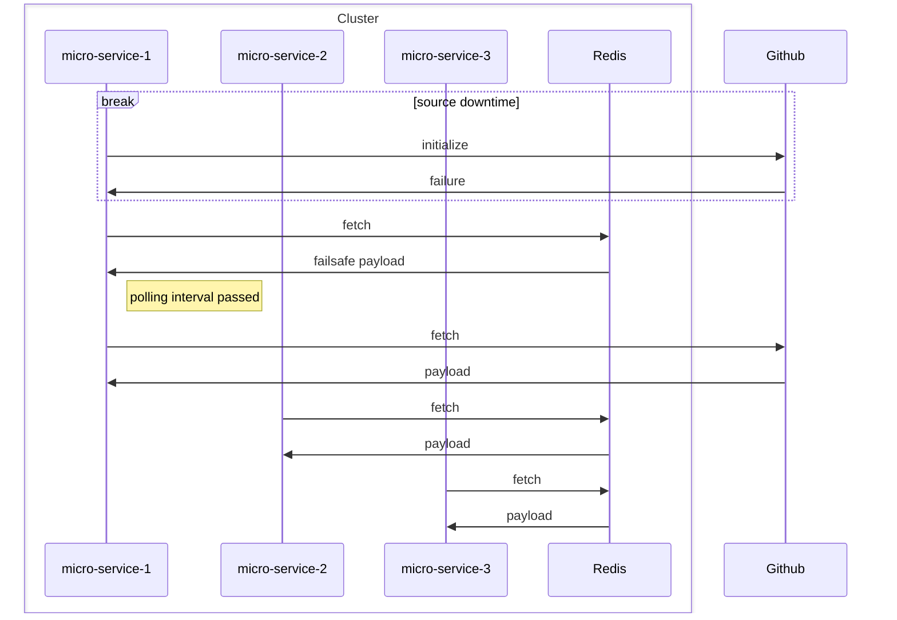

# Http Connector

## Introduction
Http Connector is a tool for [flagd](https://github.com/open-feature/flagd) in-process resolver.

This mode performs flag evaluations locally (in-process).  
Flag configurations for evaluation are obtained via Http.

## Http Connector functionality

HttpConnector is responsible for polling data from a specified URL at regular intervals.  
It is leveraging Http cache mechanism with 'ETag' header, then when receiving 304 Not Modified response,
reducing traffic, reducing rate limits effects and changes updates. Can be enabled via useHttpCache option.

## Use cases and benefits
* flagd installation is not required, the Http Connector works independently.  
  Minimizing infrastructure and DevOps overhead - no extra containers required.
* Low latency by fetching data directly in-process.
* Decreased external network traffic from the HTTP source, even without a standalone flagd container or proxy, 
  when using polling cache.
* Can serve as an additional provider for fallback or internal backup scenarios using a multi-provider setup.

### What happens if the Http source is down during application startup?

Http Connector supports optional resilient fail-safe initialization using a cache.
If the initial fetch fails due to source unavailability, it can load the initial payload from the cache instead of
falling back to default values.
This ensures smoother startup behavior until the source becomes available again. To be effective, the TTL of the
fallback cache should be longer than the expected duration of the source downtime during initialization.

### Polling cache
The polling cache is used to store the payload fetched from the URL.  
Used when usePollingCache is configured as true.
A key advantage of this cache is that it enables a single microservice within a cluster to handle the polling of a 
URL, effectively acting as a flagd/proxy while all other services leverage the shared cache. 
This approach optimizes resource usage by preventing redundant polling across services.

### Sample flows demonstrating the architecture

#### Basic Simple Configuration

This example demonstrates a simple flow using:
- GitHub as the source for flag payload.



#### A More Scalable Configuration Utilizing Fail-Safe and Polling Caching Mechanisms

This configuration aim to reduce network requests to the source URL, to improve performance and to improve the
application's resilience to source downtime.

This example demonstrates a micro-services architectural flow using:
- GitHub as the source for flag payload.
- Redis serving as both the fail-safe initialization cache and the polling cache.

Example initialization flow during GitHub downtime,
demonstrates how the application continues to access flag values from the cache even when GitHub is unavailable.
In this setup, multiple microservices share the same cache, with only one service responsible for polling the source
URL.



## Usage

### Installation
<!-- x-release-please-start-version -->
```xml
<dependency>
  <groupId>dev.openfeature.contrib.tools</groupId>
  <artifactId>flagd-http-connector</artifactId>
  <version>0.0.1</version>
</dependency>
```
<!-- x-release-please-end-version -->

### Usage example

```go

testUrl := "https://raw.githubusercontent.com/openfeature/go-sdk-contrib/refs/heads/feature/flagd-http-connector/tools/flagd-http-connector/pkg/testing-flags.json"

zapLogger, err := logger.NewZapLogger(zapcore.LevelOf(zap.DebugLevel), "json")
logger := logger.NewLogger(zapLogger, false)
opts := &HttpConnectorOptions{
  PollIntervalSeconds:   10,
  ConnectTimeoutSeconds: 5,
  RequestTimeoutSeconds: 15,
  URL:                   testUrl,
  Log:                   logger,
}

connector, err := NewHttpConnector(*opts)

provider, err := flagd.NewProvider(
  flagd.WithInProcessResolver(),
  flagd.WithCustomSyncProvider(connector),
)
```

#### HttpConnector using fail-safe cache and polling cache

```go
opts := HttpConnectorOptions{
    URL:                   customUrl,
    PollIntervalSeconds:   5,
    ConnectTimeoutSeconds: 5,
    RequestTimeoutSeconds: 15,
    log:                   customLogger,
    PayloadCache:          customCache,
    UsePollingCache:       true,
    UseFailsafeCache:      true,
    PayloadCacheOptions: &PayloadCacheOptions{
        UpdateIntervalSeconds: 5,
    },
}

connector, err := NewHttpConnector(opts)
```

### Configuration
The Http Connector can be configured using the following properties in the `HttpConnectorOptions` type:

---
Log                   *flagdlogger.Logger
	PollIntervalSeconds   int
	ConnectTimeoutSeconds int
	RequestTimeoutSeconds int
	Headers               map[string]string
	ProxyHost             string
	ProxyPort             int
	PayloadCacheOptions   *PayloadCacheOptions
	PayloadCache          PayloadCache
	UseHttpCache          bool
	UseFailsafeCache      bool
	UsePollingCache       bool
	URL                   string
	Client                *http.Client
---

| Property Name         | Type                 | Description                                                                                                                                                                 |
|-----------------------|----------------------|-----------------------------------------------------------------------------------------------------------------------------------------------------------------------------|
| Log                   | flagdlogger.Logger   | Logger for the Http Connector.                                                                                                                                              |
| PollIntervalSeconds   | int                  | The interval in seconds at which the Http Connector polls the URL for updates. Default value is 60 seconds.                                                                 |
| ConnectTimeoutSeconds | int                  | The timeout in seconds for establishing a connection to the URL. Default value is 10 seconds.                                                                               |
| RequestTimeoutSeconds | int                  | The timeout in seconds for sending a request to the URL. Default value is 10 seconds.                                                                                       |
| Headers               | map[string]string    | Additional headers to be sent with the HTTP request. Optional.                                                                                                              |
| ProxyHost             | string               | The host of the proxy to be used for the HTTP request. Optional.                                                                                                            |
| ProxyPort             | int                  | The port of the proxy to be used for the HTTP request. Optional.                                                                                                            |
| PayloadCacheOptions   | *PayloadCacheOptions | Options for the payload cache. Optional.                                                                                                                                    |
| PayloadCache          | PayloadCache         | The payload cache to be used for storing the fetched data. Optional.                                                                                                        |
| UseHttpCache          | bool                 | Whether to use the HTTP cache mechanism. Optional.                                                                                                                          |
| UseFailsafeCache      | bool                 | Whether to use the fail-safe cache for initialization. If true, the connector will attempt to load the initial payload from the cache if the initial fetch fails. Optional. |
| UsePollingCache       | bool                 | Whether to use the polling cache. If true, the connector will store the fetched data in a cache that can be shared across multiple microservices. Optional.                 |
| URL                   | string               | The URL from which to fetch the flag payload.                                                                                                                               |
| Client                | *http.Client         | The HTTP client to be used for making requests to the URL. Optional.                                                                                                        |

### Notes

- Explicit Resync() is doing nothing, as HttpConnector does not support explicit re-sync, as it should be already synced.
- Since Sync() can send messages to the channel, it is expected that the channel is listening for messages, otherwise 
  the flow can block indefinitely.
